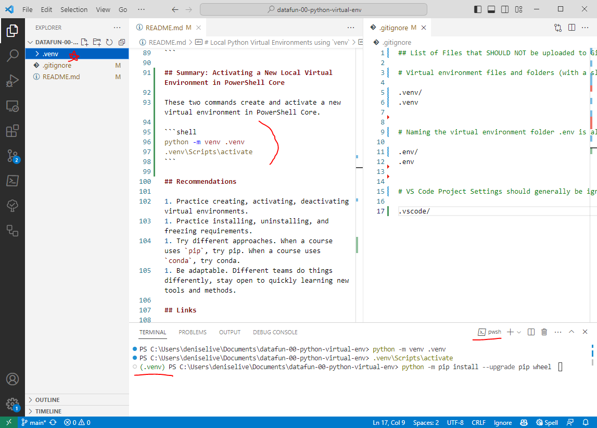

# Local Python Virtual Environments using `venv`

A virtual environment is an isolated Python environment that allows you to manage project-specific dependencies without interfering with your system's global Python installation. 

This guide:

- Uses the built-in `venv` module
- Creates a new subfolder in your project repository folder
- Names the new virtual environment folder `.venv` (pronounced as "dot venv")

Explore the .venv folder as you create, activate, and install additional Python packages into that folder. 

To learn more about why this process (over many other possibilities), see [WHY.md](./WHY.md). Join the discussion at [discussions](https://github.com/denisecase/datafun-00-python-virtual-env/discussions).

## Terminals

We type these commands in a terminal. `PowerShell Core` works well on all operating systems. 
You may also use Terminal (Mac/Linux) or Windows PowerShell or Command Prompt (Windows). 
The commands have been tested in PowerShell Core. Copy this repo and update as needed for your process. 

## Step 1: Create the Virtual Environment

Open your terminal and navigate to your project directory. Create a new local virtual environment named `.venv` by typing the following command and hitting Enter (or Return):

```shell
python -m venv .venv
```

Verify the sub folder `.venv` is created. You can replace .venv with any name you prefer. 
We like the leading dot because it keeps environment files away from project code. 

## Step 2: Activate the Virtual Environment

To use the virtual environment, you need to activate it using a command found in the new virtual environment. 
The activation process differs based on your operating system.

### On Windows:

```shell
.venv\Scripts\activate
```

### On macOS and Linux:

```shell
source .venv/bin/activate
```

Verify your terminal prompt changes, indicating that you are now working within your virtual environment.

## Step 3: Install Project Dependencies

With the virtual environment active, you can install the required packages for your project. 
What you install is specific to your project. 

You can:

- Install and upgrade multiple packages in a single line
- Install packages one at a time
- Install all packages listed in a `requirements.txt` file using the `-r` flag

Examples are shown below. 

Verify your virtual environment appears in your terminal prompt before running installation commands. 
Let each command finish before running another. 

```shell
python -m pip install --upgrade pip wheel
python -m pip install requests
python -m pip install pandas
python -m pip install -r requirements.txt
```

## Optional/As Needed: Creating A New Requirements File

If you want to share your project with others or deploy it on a different system, 
it's a good practice to include the virtual environment details. 
This ensures that anyone working on your project has the same environment and dependencies.

To create a new requirements.txt with the packages in the virtual environment, run the following command:

```shell
pip freeze > requirements.txt
```

## Optional/As Needed: Deactivate the Virtual Environment

```shell
deactivate
```

## Summary: Activating a New Local Virtual Environment in PowerShell Core

These two commands create and activate a new virtual environment in PowerShell Core.

```shell
python -m venv .venv
.venv\Scripts\activate
```

## Recommendations

1. Practice creating, activating, deactivating virtual environments.
1. Practice installing, uninstalling, and freezing requirements.
1. Try different approaches. When a course uses `pip`, try pip. When a course uses `conda`, try conda.
1. Be adaptable. Different teams do things differently, stay open to quickly learning new tools and methods.

## Virtual Environments and Jupyter Notebooks

- [Using Jupyter Notebook in Virtual Environment](https://www.geeksforgeeks.org/using-jupyter-notebook-in-virtual-environment/)

Note that the article names their virtual environment `venv` while we use the name `.venv` above. If you use .venv, the command would be:

```shell
ipython kernel install --user --name=.venv
```

## Links

- [This GitHub Repo](https://github.com/denisecase/datafun-00-python-virtual-env/)
- [Real Python Primer on Virtual Environments](https://realpython.com/python-virtual-environments-a-primer/)
- [Python Engineer on Virtual Environments](https://www.python-engineer.com/posts/virtual-environments-python/)


## Screen Shots


